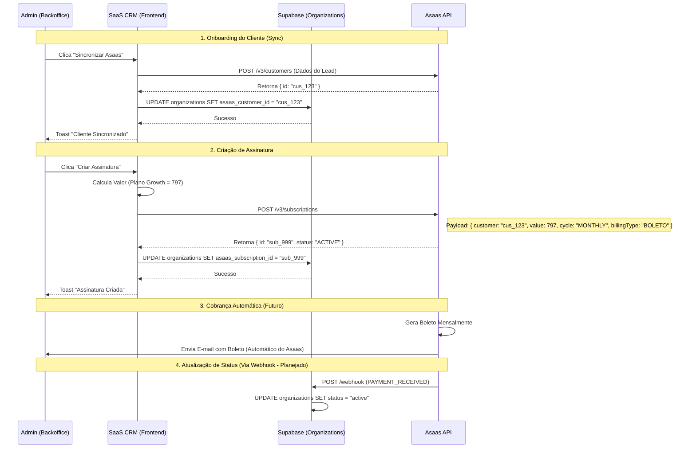

# Fluxo Financeiro SaaS - Integração Asaas

Este documento descreve o fluxo de dados entre o Sistema CRM (I'mdoc) e o Gateway de Pagamento (Asaas).

## Diagrama de Fluxo



## Estrutura de Dados

### Organization (Supabase)
```sql
| Column                | Type | Description                     |
|-----------------------|------|---------------------------------|
| id                    | uuid | ID interno                      |
| plan                  | text | Start, Growth, Empire           |
| asaas_customer_id     | text | Chave estrangeira do Asaas      |
| asaas_subscription_id | text | Chave da assinatura recorrente  |
| saas_status           | text | active, delinquent, trial       |
```

## Próximos Passos
1. Configurar Webhooks no Painel do Asaas para apontar para `https://<supabase-url>/functions/v1/asaas-webhook`.
2. Criar Edge Function para processar `PAYMENT_RECEIVED` e `PAYMENT_OVERDUE`.
